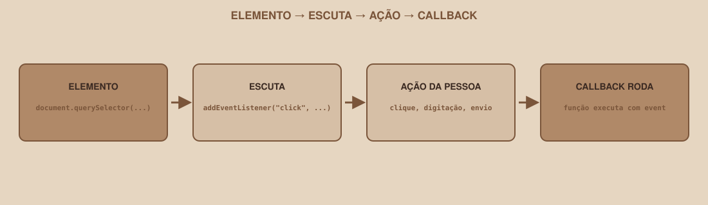

# Módulo 09, Eventos

`SEM 03 // Interface Web, Parte 2: Dinâmica`

---

## // O problema

Tudo que você escreveu até agora roda **uma vez**, assim que o script carrega (Módulo 01). Mas a maior parte do comportamento real de uma interface só deveria acontecer **em resposta** a uma ação: clicar em "Entrar", digitar em um campo, enviar um formulário. Este módulo é onde "código que roda sozinho" vira "código que reage".

## // O que é um evento

> **EVENTO: EM PALAVRAS SIMPLES**
> É algo que acontece na página: um clique, uma tecla pressionada, um formulário enviado, que o JavaScript pode "escutar" e reagir a ele.

<div align="center">

</div>

## // `addEventListener`

```javascript
const botao = document.querySelector("#botao-entrar");

botao.addEventListener("click", function () {
  console.log("Botão clicado");
});
```

Três partes: o **elemento** que vai escutar (`botao`), o **tipo de evento** (`"click"`), e a **função** que roda quando o evento acontece: essa função costuma ser chamada de *callback*, porque o JavaScript "chama de volta" quando o evento ocorre, não imediatamente quando essa linha é lida.

## // Eventos mais comuns

| Evento | Quando ocorre |
|---|---|
| `click` | Clique em qualquer elemento |
| `input` | O valor de um campo muda, a cada tecla digitada |
| `change` | O valor de um campo muda **e** perde o foco (comum em `select`) |
| `submit` | Um formulário é enviado |
| `keydown` | Uma tecla é pressionada |
| `DOMContentLoaded` | O HTML terminou de ser lido (raramente necessário se você já usa `defer`, Módulo 01) |

## // O objeto `event`

A função de callback recebe, automaticamente, um objeto com informações sobre o que aconteceu, por convenção, chamado de `event` ou `e`:

```javascript
const form = document.querySelector("#form-login");

form.addEventListener("submit", function (event) {
  event.preventDefault();
  console.log("Envio controlado pelo JavaScript, sem recarregar a página");
});
```

> **`EVENT.PREVENTDEFAULT()`**
> Formulários, por padrão, tentam recarregar a página ao serem enviados: é o comportamento nativo do HTML, de antes de existir JavaScript. `event.preventDefault()` cancela esse comportamento padrão, deixando você no controle total do que acontece com os dados do formulário. Sem essa linha, qualquer lógica de validação (Módulo 10) seria interrompida pelo recarregamento antes de rodar.

## // `input` × `change`

```javascript
const campoBusca = document.querySelector(".busca");

campoBusca.addEventListener("input", function (event) {
  console.log("Buscando por:", event.target.value);
});
```

`event.target` é o elemento que disparou o evento: no caso de um campo de texto, `event.target.value` é o valor atual, tecla por tecla. É exatamente esse padrão que conecta o campo de busca do Dashboard a `filtrarPorBusca(...)` (Módulo 12): a cada tecla digitada, o evento `input` dispara, e a busca roda de novo.

## // O fluxo mental completo

1. Localizo o elemento (Módulo 07).
2. Escuto o evento certo, com `addEventListener`.
3. Quando ele acontece, leio os dados relevantes (`event.target.value`, por exemplo).
4. Decido o que fazer com esses dados (Módulo 03, decisões).
5. Atualizo a tela ou os dados guardados (Módulo 08, e Módulo 12 para listas).

Esse ciclo de cinco passos é, na prática, o "esqueleto" de praticamente toda interação dinâmica que você vai construir a partir de agora.

## // Bom exemplo × mau exemplo

**Mau exemplo**: esquecer `preventDefault` em um formulário:

```javascript
form.addEventListener("submit", function (event) {
  console.log("Isso roda, mas a página recarrega logo em seguida");
});
```

**Bom exemplo**: controle total do envio:

```javascript
form.addEventListener("submit", function (event) {
  event.preventDefault();
  console.log("Processo o formulário sem recarregar");
});
```

## // Erros comuns

| Erro | Por que acontece | Como corrigir |
|---|---|---|
| Página recarrega ao enviar o formulário | Faltou `event.preventDefault()` no evento `submit` | Adicione a chamada como primeira linha da função |
| Callback não recebe o evento certo | Esqueceu de declarar o parâmetro (`function (event) {...}`) | Sempre declare o parâmetro, mesmo que só use `event.target` às vezes |
| `addEventListener` "não funciona" | Elemento selecionado antes de existir, ou seletor errado (Módulo 07) | Confirme a seleção com `console.log(elemento)` antes de adicionar o listener |
| Evento disparando várias vezes por uma ação só | `addEventListener` chamado mais de uma vez para o mesmo elemento/evento, geralmente por a função rodar de novo sem necessidade | Garanta que a configuração de eventos roda uma única vez, ao carregar a página |

## // Prática guiada

1. No Dashboard, selecione o botão "Participar" de um card e adicione um `addEventListener("click", ...)` que imprime uma mensagem no console.
2. No Login, selecione o `<form>` e adicione um listener de `submit`, com `event.preventDefault()` como primeira linha.
3. No campo de busca, adicione um listener de `input` que imprime `event.target.value` a cada tecla digitada.
4. Teste os três no navegador, observando o console.

## // Pratique sozinho

> **DESAFIO**
> Adicione um listener de `click` a um elemento (qualquer um) que, a cada clique, usa `classList.toggle("ativo")` nele mesmo (`event.target.classList.toggle(...)`). Confirme visualmente, mesmo sem estilo definido para `.ativo` ainda, que a classe aparece e desaparece a cada clique, inspecionando o elemento pelo DevTools.

## // Aplicando no projeto da semana

1. Adicione `addEventListener` aos elementos interativos reais do seu projeto: botão de Login, campo de busca do Dashboard, e pelo menos um botão do Perfil.
2. Garanta que o formulário de Login usa `event.preventDefault()`.
3. Commit: `git commit -m "Adiciona escuta de eventos nos elementos interativos"`.

## // Checkpoint

> **ANTES DE SEGUIR, PENSE NISTO**
> Um botão "Participar" tem um `addEventListener("click", ...)`, mas nada acontece ao clicar, nem erro no console, nem nenhuma mudança. O que você investigaria, nesta ordem?

Resposta: primeiro, se o `querySelector` realmente encontrou o botão (`console.log(botao)`; se vier `null`, o listener nunca foi de fato adicionado a nada). Segundo, se o seletor usado bate exatamente com o elemento certo, especialmente se existir mais de um botão parecido na página. Terceiro, se o próprio callback tem algum código que realmente produz um efeito observável: um `addEventListener` sem nenhuma linha visível dentro da função "funciona", só não parece fazer nada.

## // Resumo do módulo

- [ ] Sei usar `addEventListener` para escutar um evento em um elemento.
- [ ] Sei a diferença entre `click`, `input`, `change` e `submit`.
- [ ] Sei o que é o objeto `event`, e o que `event.target` representa.
- [ ] Sei por que `event.preventDefault()` é necessário em formulários.
- [ ] Já conectei eventos reais aos elementos interativos do meu projeto.

---

**Próximo módulo:** `10-formularios-e-validacao-em-js.md`, com eventos prontos, hora de aplicar isso diretamente no formulário de Login.

`Material de Estudo // Coffee & Code`
