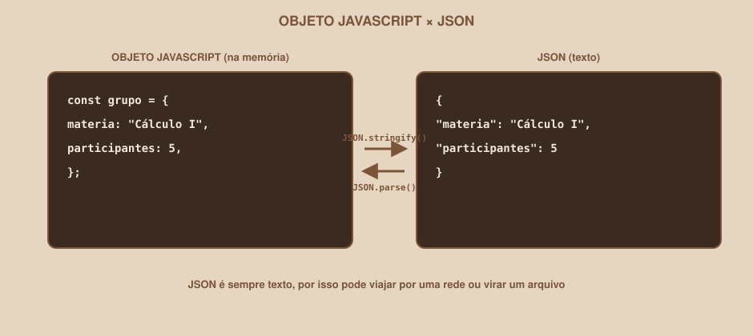

# Módulo 11, JSON e Dados Mock

`SEM 03 // Interface Web, Parte 2: Dinâmica`

---

## // O problema

Os grupos do Dashboard, até agora, moram direto no `script.js`, como um array escrito à mão. Isso funciona para estudar, mas um sistema real busca esses dados de algum lugar externo (um servidor). O Coffee & Code ainda não chegou na semana de backend, então a pergunta é: como simular essa realidade, sem ter um servidor de verdade ainda?

## // O que é JSON

> **JSON: EM PALAVRAS SIMPLES**
> É um formato de texto para representar dados, parecido com um objeto ou array do JavaScript, mas é *texto puro*, e por isso pode ser enviado por uma rede, salvo em um arquivo, ou trocado entre linguagens de programação diferentes (JSON não é exclusivo de JavaScript, embora o nome venha de lá: *JavaScript Object Notation*).

<div align="center">

</div>

## // JSON × objeto JavaScript: parecidos, mas não iguais

```javascript
// Objeto JavaScript (vive na memória, enquanto o script roda)
const grupo = {
  materia: "Cálculo I",
  participantes: 5,
};
```

```json
{
  "materia": "Cálculo I",
  "participantes": 5
}
```

| | Objeto JavaScript | JSON |
|---|---|---|
| O que é | Uma estrutura de dados, na memória | **Texto**, seguindo um formato específico |
| Chaves das propriedades | Podem vir sem aspas (`materia:`) | Sempre entre aspas duplas (`"materia":`) |
| Pode ter funções/métodos dentro? | Sim | Não, JSON só representa dados, nunca comportamento |
| Onde aparece | Direto no código JavaScript | Arquivos `.json`, respostas de API, `localStorage` |

## // Convertendo entre os dois formatos

```javascript
const grupo = { materia: "Cálculo I", participantes: 5 };

const textoJSON = JSON.stringify(grupo);
console.log(textoJSON); // '{"materia":"Cálculo I","participantes":5}'

const objetoDeVolta = JSON.parse(textoJSON);
console.log(objetoDeVolta.materia); // Cálculo I
```

| Função | Direção |
|---|---|
| `JSON.stringify(objeto)` | Objeto/array JavaScript → texto JSON |
| `JSON.parse(texto)` | Texto JSON → objeto/array JavaScript |

Você não vai precisar converter o tempo todo nesta semana, mas vai precisar entender esse par de funções quando o clube chegar em salvar dados (`localStorage`) ou buscar de uma API de verdade, em semanas futuras.

## // Dados mock: simulando uma API antes dela existir

> **DADOS MOCK: EM PALAVRAS SIMPLES**
> São dados falsos, escritos à mão, no formato que os dados reais *vão* ter quando existirem, usados para desenvolver e testar uma interface antes do backend estar pronto.

```javascript
const gruposMock = [
  { id: 1, materia: "Cálculo I", participantes: 5, horario: "terças às 18h" },
  { id: 2, materia: "Estrutura de Dados", participantes: 3, horario: "quintas às 19h" },
  { id: 3, materia: "Banco de Dados", participantes: 8, horario: "sábados às 10h" },
];
```

O array `gruposMock` não é diferente, estruturalmente, do array `grupos` que você já vem usando desde o Módulo 05; a diferença é de **intenção**: nomear como "mock" deixa claro, para qualquer pessoa lendo o código, que esses dados são temporários, e que um dia serão substituídos por uma busca real a um servidor, sem que a lógica de renderização (Módulo 12) precise mudar nada.

## // Por que isso importa: separar dados de exibição

Se `renderizarGrupos(lista)` (Módulo 12) só depende de receber um array no formato certo, não importa se esse array veio de `gruposMock` (hoje) ou de uma resposta de API de verdade (no futuro): a função de renderização não muda. É esse desacoplamento que torna a migração de mock para dados reais, mais adiante no clube, um processo tranquilo em vez de uma reescrita.

## // Adicionando um `id` a cada item

Repare que cada objeto do `gruposMock` acima tem um campo `id`, que os exemplos de módulos anteriores não tinham. Isso importa a partir de agora: quando uma pessoa clicar em "Sair do grupo" (Módulo 14), o código vai precisar saber *qual* item exato do array remover: comparar por `materia` funcionaria até dois grupos terem nomes parecidos. Um `id` único resolve isso de forma confiável.

## // Bom exemplo × mau exemplo

**Mau exemplo**: dados mock sem identificação clara nem `id`:

```javascript
const dados = [
  ["Cálculo I", 5],
  ["Estrutura de Dados", 3],
];
```

Difícil de ler, sem nomes de propriedades, e sem `id` para localizar um item específico depois.

**Bom exemplo**: array de objetos, nomeado como mock, com `id`:

```javascript
const gruposMock = [
  { id: 1, materia: "Cálculo I", participantes: 5 },
  { id: 2, materia: "Estrutura de Dados", participantes: 3 },
];
```

## // Erros comuns

| Erro | Por que acontece | Como corrigir |
|---|---|---|
| `JSON.parse` quebrando com erro | O texto não é JSON válido (aspas simples, vírgula sobrando) | JSON exige aspas duplas nas chaves, e não aceita vírgula depois do último item |
| Confundir objeto JavaScript com JSON | Os dois se parecem muito visualmente | Lembre: JSON é sempre texto; objeto é uma estrutura viva na memória |
| Esquecer o `id` nos dados mock | Parece desnecessário quando só se está lendo os dados | Adicione desde já; evita retrabalho quando ações de remover/editar chegarem |
| Nomear dados mock como se fossem definitivos | Esquecer de sinalizar que são temporários | Use um nome como `gruposMock` ou um comentário deixando isso explícito |

## // Prática guiada

1. Transforme o array `grupos` que você já vem usando em `gruposMock`, adicionando um `id` único a cada item.
2. Use `JSON.stringify(gruposMock)` e imprima o resultado no console. Observe as aspas duplas nas chaves.
3. Use `JSON.parse(...)` no texto gerado, e confirme que o resultado é equivalente ao array original.

## // Pratique sozinho

> **DESAFIO**
> Escreva, em um comentário ou string separada, um JSON válido representando um objeto `usuario` (nome, e-mail, array de `materias`). Use `JSON.parse(...)` para transformar esse texto em um objeto de verdade, e confirme lendo `usuario.materias.length` no console.

## // Aplicando no projeto da semana

1. Renomeie o array de dados do seu Dashboard para `gruposMock`, garantindo que cada item tem um `id` único.
2. Faça o mesmo para os dados do Perfil, se aplicável.
3. Commit: `git commit -m "Formaliza dados como mock, com id único por item"`.

## // Checkpoint

> **ANTES DE SEGUIR, PENSE NISTO**
> Por que nomear os dados como `gruposMock`, em vez de só `grupos`, ajuda qualquer pessoa (inclusive você, meses depois) a entender o código mais rápido?

Resposta: o nome comunica, sem precisar de nenhum comentário adicional, que esses dados são temporários e vão ser substituídos por uma fonte real (uma API) no futuro, evitando que alguém presuma, por engano, que esse array já representa a fonte definitiva de dados do sistema. É o mesmo princípio de nomes claros que já apareceu em módulos anteriores: o nome de uma variável deveria comunicar sua função, não só seu conteúdo.

## // Resumo do módulo

- [ ] Sei explicar a diferença entre um objeto JavaScript e JSON.
- [ ] Sei usar `JSON.stringify` e `JSON.parse`, e em que direção cada um converte.
- [ ] Sei o que são dados mock, e por que nomeá-los como tal importa.
- [ ] Sei por que cada item de um array mock deveria ter um `id` único.
- [ ] Os dados do meu projeto já estão organizados como mock, com `id`.

---

**Próximo módulo:** `12-renderizando-listas-dinamicamente.md`, dados prontos, estruturados, com `id`. Hora de colocá-los na tela de verdade.

`Material de Estudo // Coffee & Code`
