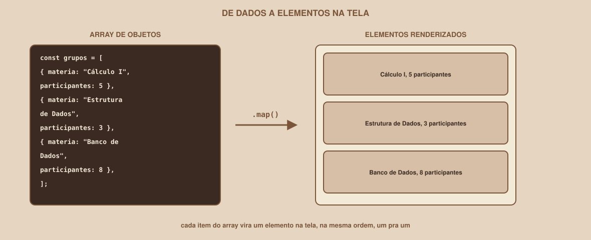

# Módulo 00, Comece Aqui

`SEM 03 // Interface Web, Parte 2: Dinâmica`

---

## // Bem-vindo à Semana 03

Se você seguiu a Semana 02, tem hoje três páginas, Login, Dashboard e Perfil, bonitas, organizadas, responsivas. Abra o Dashboard agora e clique em "Participar" em qualquer card. Nada acontece. Digite qualquer coisa (ou nada) no formulário de Login e clique em "Entrar". Nada acontece, e nenhum erro aparece se você deixou o campo vazio.

Isso não é falha do que você construiu, e é exatamente onde a Semana 02 disse que ia parar. HTML e CSS resolvem estrutura e aparência. Nenhum dos dois resolve *comportamento*. É disso que esta semana trata.

## // O que muda a partir de agora

Até a Semana 02, o HTML do Dashboard tinha os cards escritos à mão, um por um, direto no arquivo. A partir desta semana, os cards vão nascer de uma lista de dados, um array, e a tela vai se atualizar sozinha quando essa lista mudar. É a diferença entre uma vitrine fixa e uma vitrine que se reorganiza conforme o estoque muda.

## // O que você vai construir até o fim da semana

- O formulário de Login validando de verdade: campo vazio, e-mail mal formatado, senha curta, tudo bloqueado antes de qualquer envio, com mensagem de erro visível.
- O grid do Dashboard renderizado inteiramente a partir de um array de dados (simulado, sem backend ainda): adicionar um item ao array deveria, sozinho, adicionar um card na tela.
- Uma busca que realmente filtra os grupos exibidos, sem recarregar a página.
- O Perfil refletindo dados de um objeto, com pelo menos uma ação (como sair de um grupo) atualizando a tela sem reload.

## // O que ainda fica de fora

Mesmo criando bastante lógica nova, o escopo continua deliberadamente contido:

> **AINDA NÃO NESTA SEMANA**
> Nenhum backend real, nenhum banco de dados, nenhuma chamada de rede de verdade para um servidor seu. Os dados "de fora" continuam simulados, um array escrito no próprio JavaScript, representando o que um dia virá de uma API. A diferença para a Semana 02 é que agora existe *lógica* processando esses dados, não que exista um servidor novo.

## // Por que JavaScript, e não outra coisa

> **JAVASCRIPT: EM PALAVRAS SIMPLES**
> É a linguagem que roda no navegador e permite que uma página reaja, leia valores, tome decisões, repita ações, altere o que está na tela, sem precisar recarregar.

Voltando ao modelo do Módulo 01 da Semana 02: HTML é estrutura, CSS é apresentação, JavaScript é comportamento. As duas primeiras peças já existem nas suas três telas. Esta semana constrói exatamente a terceira.

## // As duas trilhas

**Se você está começando**, nunca escreveu uma linha de JavaScript. O caminho principal de cada módulo assume isso: cada conceito (variável, função, evento) é apresentado antes de ser necessário, nunca depois.

**Se você já tem experiência**, já programou em JavaScript ou outra linguagem antes. Cada módulo tem blocos de aprofundamento, claramente identificados, depois do conteúdo essencial: gerenciamento de estado e um padrão simples de organizar a interface em componentes, sem usar nenhum framework ainda.

Ninguém trabalha em um projeto diferente, todo mundo dá comportamento às mesmas três telas do Buscador de Grupos de Estudo (ou ao seu projeto próprio). A profundidade é que muda.

## // Mapa da Semana 03

| Módulo | Conteúdo | Você vai conseguir |
|---|---|---|
| 01 | Como o JavaScript entra na página | Conectar um `.js` ao HTML corretamente |
| 02 | Variáveis, tipos e operadores | Guardar e comparar valores |
| 03 | Decisões e repetições | Controlar o que acontece, e quantas vezes |
| 04 | Funções e arrow functions | Organizar lógica em blocos reutilizáveis |
| 05 | Arrays e métodos essenciais | Transformar listas de dados |
| 06 | Objetos e desestruturação | Modelar "uma coisa" com várias propriedades |
| 07 | O DOM: selecionar e ler | Encontrar elementos que já existem na página |
| 08 | O DOM: criar e modificar elementos | Adicionar e alterar conteúdo na tela |
| 09 | Eventos | Reagir a cliques, digitação, envio de formulário |
| 10 | Formulários e validação em JS | Bloquear envios inválidos, com mensagens claras |
| 11 | JSON e dados mock | Simular dados de uma API, sem precisar de uma |
| 12 | Renderizando listas dinamicamente | Array de dados → cards na tela, automaticamente |
| 13 | Estado e componentização | Organizar a interface conforme ela cresce |
| 14 | Projeto guiado | Login, Dashboard e Perfil dinâmicos, do início ao fim |

Cada módulo é um arquivo independente, mas foram escritos para serem lidos nesta ordem: uma função só faz sentido depois de entender variável e decisão; renderizar uma lista só faz sentido depois de já saber selecionar e criar elementos no DOM.

---

**Próximo módulo:** `01-como-o-javascript-entra-na-pagina.md`, antes de escrever a primeira linha de lógica, entenda onde e quando ela roda.

`Material de Estudo // Coffee & Code`
