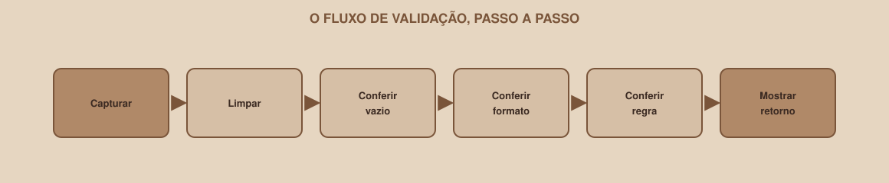

# Módulo 10, Formulários e Validação em JS

`SEM 03 // Interface Web, Parte 2: Dinâmica`

---

## // Antes de começar

Lembra do Módulo 03 (Semana 02): `required` no HTML já impede enviar um campo vazio, sem nenhum JavaScript. Então por que este módulo existe? Porque `required` sozinho não valida *regras*: não confirma que uma senha tem tamanho mínimo, não mostra uma mensagem de erro específica e estilizada, não confirma dois campos relacionados entre si. É exatamente isso que JavaScript resolve, por cima do que o HTML já garante.

## // O fluxo de validação

<div align="center">

</div>

| Passo | Pergunta |
|---|---|
| 1. Capturar | Quais elementos e valores eu preciso ler? |
| 2. Limpar | Preciso de `.trim()` (remover espaços do início/fim) ou `Number(...)`? |
| 3. Conferir vazio | O campo obrigatório foi preenchido? |
| 4. Conferir formato | O valor segue o padrão esperado (um e-mail parece um e-mail)? |
| 5. Conferir regra | O dado faz sentido para o seu sistema (senha com tamanho mínimo, por exemplo)? |
| 6. Mostrar retorno | A mensagem diz claramente o que a pessoa precisa corrigir? |

## // Exemplo completo: validando o Login

```javascript
const form = document.querySelector("#form-login");
const campoEmail = document.querySelector("#email");
const campoSenha = document.querySelector("#senha");
const erroEmail = document.querySelector("#erro-email");
const erroSenha = document.querySelector("#erro-senha");

form.addEventListener("submit", function (event) {
  event.preventDefault();

  const email = campoEmail.value.trim();
  const senha = campoSenha.value;

  erroEmail.textContent = "";
  erroSenha.textContent = "";
  let valido = true;

  if (!email) {
    erroEmail.textContent = "Digite seu e-mail.";
    valido = false;
  } else if (!email.includes("@")) {
    erroEmail.textContent = "Digite um e-mail válido.";
    valido = false;
  }

  if (senha.length < 8) {
    erroSenha.textContent = "A senha precisa ter pelo menos 8 caracteres.";
    valido = false;
  }

  if (valido) {
    console.log("Formulário válido, aqui entraria o envio de verdade");
  }
});
```

Repare na estrutura: **cada campo** tem sua própria checagem, sua própria mensagem de erro, e a variável `valido` só vira `false` quando alguma regra falha, permitindo mostrar *todos* os erros de uma vez, não só o primeiro encontrado.

## // Por que `.trim()` importa

```javascript
const nome = "   ".trim(); // ""
if (!nome) {
  console.log("Campo vazio, mesmo tendo espaços digitados");
}
```

Sem `.trim()`, alguém que digita só espaços passaria pela checagem de campo vazio (já que `"   "` não é uma string vazia, tecnicamente). `.trim()` remove espaços do início e do fim, revelando que não há conteúdo real ali.

## // Mensagens boas × mensagens vagas

> **O QUE FAZ UMA BOA MENSAGEM DE ERRO**
> "Dado inválido" não diz o que fazer. "A senha precisa ter pelo menos 8 caracteres" diz exatamente o que corrigir. Sempre que possível, a mensagem deveria responder: o que está errado, e o que a pessoa precisa fazer para corrigir.

## // Limpando mensagens de erro anteriores

Repare, no exemplo completo, nas duas linhas logo no início da função: `erroEmail.textContent = ""` e `erroSenha.textContent = ""`. Sem isso, uma mensagem de erro de uma tentativa anterior continuaria na tela mesmo depois de corrigida, porque nada nunca a apaga. Toda validação deveria começar limpando o estado de erro anterior, antes de checar de novo.

## // Bom exemplo × mau exemplo

**Mau exemplo**: só usar `alert()` para mostrar erro:

```javascript
if (!email) {
  alert("Erro!");
}
```

`alert()` interrompe toda a página até a pessoa clicar "OK", não indica *qual* campo está errado, e não pode ser estilizado de forma alguma.

**Bom exemplo**: mensagem inline, específica, perto do campo:

```javascript
if (!email) {
  erroEmail.textContent = "Digite seu e-mail.";
}
```

## // Erros comuns

| Erro | Por que acontece | Como corrigir |
|---|---|---|
| Só o primeiro erro aparece, os demais são ignorados | Usar `return` dentro de cada `if`, interrompendo a função inteira | Use uma variável `valido` que se torna `false`, sem interromper a checagem dos outros campos |
| Mensagem de erro antiga continua na tela | Esqueceu de limpar (`.textContent = ""`) no início da validação | Sempre limpe as mensagens de erro antes de checar de novo |
| Campo só com espaços passa como preenchido | Faltou `.trim()` antes de testar se está vazio | Sempre `.trim()` valores de texto antes de checar vazio |
| Formulário ainda recarrega a página | Faltou `event.preventDefault()` (Módulo 09) | Adicione como a primeira linha da função de `submit` |

## // Prática guiada

1. No Login, adicione elementos para mensagem de erro perto de cada campo (um `<span>` ou `<p>` com `id` único, se ainda não existir).
2. Escreva a validação completa, seguindo o exemplo desta seção: e-mail obrigatório e com "@", senha com pelo menos 8 caracteres.
3. Teste: envie vazio, envie com e-mail sem "@", envie com senha curta, envie tudo certo. Confirme que cada caso mostra (ou não mostra) o erro esperado.
4. Confirme que corrigir um campo e reenviar limpa a mensagem de erro anterior.

## // Pratique sozinho

> **DESAFIO**
> Adicione uma segunda regra ao campo de senha: ela não pode ser igual ao e-mail digitado (uma checagem simples de segurança). Escreva a mensagem de erro correspondente, e garanta que ela também respeita o padrão de limpar mensagens antigas antes de validar de novo.

## // Aplicando no projeto da semana

1. Implemente a validação completa do formulário de Login do seu projeto, com pelo menos duas regras por campo (vazio + formato, ou vazio + tamanho mínimo).
2. Garanta que as mensagens de erro são específicas, não genéricas.
3. Commit: `git commit -m "Adiciona validação de formulário em JavaScript"`.

## // Checkpoint

> **ANTES DE SEGUIR, PENSE NISTO**
> Sua validação usa `return` dentro do primeiro `if` que falha, em vez de uma variável `valido`. A pessoa deixa e-mail E senha errados, e envia o formulário. O que ela vê?

Resposta: só a mensagem de erro do e-mail. Como o `return` sai da função assim que a primeira condição falha, a checagem da senha nunca chega a rodar, mesmo estando errada também. A pessoa corrige o e-mail, reenvia, e só *aí* descobre que a senha também estava errada, uma experiência frustrante de erros "em cascata". Usar uma variável `valido` (sem `return` antecipado) permite mostrar todos os erros de uma vez.

## // Resumo do módulo

- [ ] Sei o fluxo de seis passos de uma validação (capturar → limpar → vazio → formato → regra → retorno).
- [ ] Sei por que `.trim()` evita que espaços em branco passem como preenchido.
- [ ] Sei escrever mensagens de erro específicas, não genéricas.
- [ ] Sei por que usar uma variável `valido` (em vez de `return` antecipado) permite mostrar todos os erros de uma vez.
- [ ] O formulário de Login do meu projeto já valida de verdade, com mensagens claras.

---

**Próximo módulo:** `11-json-e-dados-mock.md`, antes de renderizar uma lista de verdade, como representar e simular esses dados sem precisar de um backend ainda.

`Material de Estudo // Coffee & Code`
