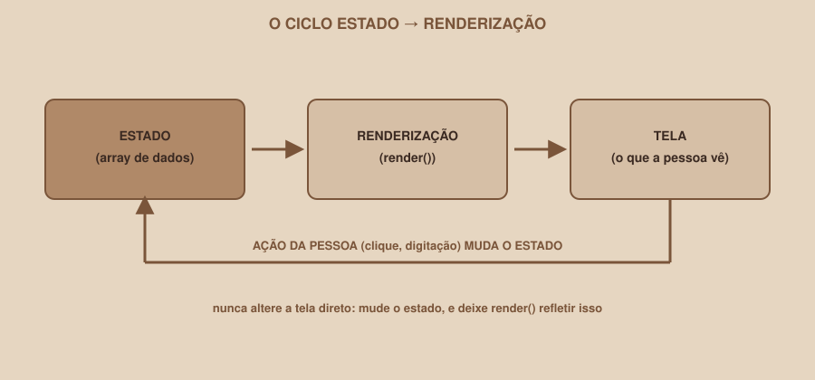
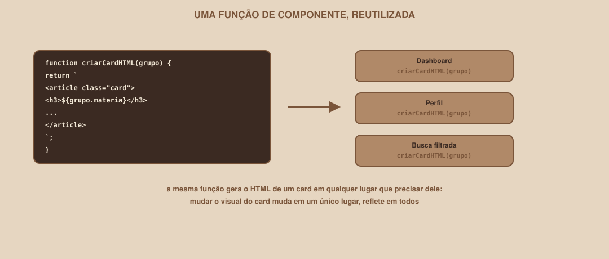

# Módulo 13, Estado e Componentização

`SEM 03 // Interface Web, Parte 2: Dinâmica`

---

## // Antes de começar

Este módulo assume que o Módulo 12 já está sólido: renderizar uma lista a partir de um array. Aqui a pergunta muda: conforme a interface cresce, como evitar que os dados fiquem inconsistentes entre diferentes partes da tela, e como evitar reescrever o mesmo HTML em vários lugares?

## // O problema

Imagine que o Dashboard mostra "6 grupos encontrados" em um texto, **além** do grid de cards. Se uma pessoa sai de um grupo (removendo um item do array) e você lembra de atualizar o grid, mas esquece de atualizar aquele texto: agora a tela mostra informações contraditórias. Quanto mais lugares da tela dependem dos mesmos dados, maior o risco de esquecer de atualizar algum.

## // O que é "estado"

> **ESTADO: EM PALAVRAS SIMPLES**
> É a "fonte da verdade" dos dados da sua aplicação, em um único lugar: tudo o que aparece na tela deveria ser um reflexo desse estado, nunca uma cópia alterada separadamente dele.

No seu projeto, o array `gruposMock` (Módulo 11) já **é** o estado do Dashboard. O que este módulo formaliza é uma regra sobre como lidar com ele.

## // O ciclo estado → renderização

<div align="center">

</div>

> **A REGRA CENTRAL DESTE MÓDULO**
> Nunca altere a tela diretamente em resposta a uma ação. Altere o **estado**, e chame a função de renderização de novo: deixe a tela ser sempre um reflexo do estado atual, nunca uma edição manual e paralela a ele.

## // Aplicando a regra: removendo um item

```javascript
let gruposMock = [
  { id: 1, materia: "Cálculo I", participantes: 5 },
  { id: 2, materia: "Estrutura de Dados", participantes: 3 },
  { id: 3, materia: "Banco de Dados", participantes: 8 },
];

function removerGrupo(id) {
  gruposMock = gruposMock.filter((grupo) => grupo.id !== id);
  renderizarGrupos(gruposMock);
}
```

Repare que `removerGrupo` não toca no DOM em nenhum momento: ele só atualiza o array (`gruposMock`) e chama `renderizarGrupos` de novo, que já sabe reconstruir a tela inteira a partir do estado atual (Módulo 12). A função de renderização nunca precisa saber *por que* os dados mudaram, só *que* mudaram.

> **POR QUE `GRUPOSMOCK` VIROU `LET`**
> Desde o Módulo 02: `const` impede reatribuir a variável inteira. Como `removerGrupo` reatribui `gruposMock` (`gruposMock = gruposMock.filter(...)`), a variável precisa ser `let`. Se você só alterasse itens de dentro do array (sem reatribuir o array inteiro), `const` continuaria funcionando, mas filtrar sempre cria um array novo, então a variável que o guarda precisa aceitar reatribuição.

## // Componentização: uma função por "pedaço" de interface

> **COMPONENTIZAÇÃO: EM PALAVRAS SIMPLES**
> É extrair uma função que sabe construir um pedaço específico e reutilizável da interface, em vez de reescrever a mesma estrutura de HTML em vários lugares do código.

<div align="center">

</div>

```javascript
function criarCardHTML(grupo) {
  return `
    <article class="card">
      <h3>${grupo.materia}</h3>
      <p>${grupo.participantes} participantes</p>
      <button class="botao botao-primario" data-id="${grupo.id}">Participar</button>
    </article>
  `;
}

function renderizarGrupos(lista) {
  container.innerHTML = lista.map(criarCardHTML).join("");
}
```

Note que `.map(criarCardHTML)` passa a função diretamente, sem precisar escrever `.map((grupo) => criarCardHTML(grupo))`: quando a função já recebe exatamente o argumento que `.map()` fornece, não é necessário envolvê-la em outra função.

## // Por que isso compensa, mesmo em um projeto pequeno

Se o Perfil também precisar mostrar cards de grupos (os grupos dos quais a pessoa participa), `criarCardHTML` pode ser reutilizada ali, sem duplicar a estrutura do card. Se o visual do card precisar mudar (um novo botão, uma nova informação), muda em um único lugar, e reflete em toda tela que usa essa função.

## // Sem framework, de propósito

Frameworks como React (que você vai conhecer em semanas futuras do clube, se o percurso continuar) formalizam exatamente esses dois conceitos, estado e componentização, com ferramentas próprias e mais poderosas. Entender o padrão em JavaScript puro primeiro é o que torna um framework, mais adiante, parecer uma extensão natural do que você já sabe, em vez de uma sintaxe nova e arbitrária para decorar.

## // Bom exemplo × mau exemplo

**Mau exemplo**: alterando a tela diretamente, sem passar pelo estado:

```javascript
botaoSair.addEventListener("click", function () {
  document.querySelector(".card").remove(); // remove só da tela
  // gruposMock continua com o item "removido", dessincronizado
});
```

**Bom exemplo**: alterando o estado, deixando a renderização refletir:

```javascript
botaoSair.addEventListener("click", function () {
  gruposMock = gruposMock.filter((g) => g.id !== idDoGrupo);
  renderizarGrupos(gruposMock);
});
```

## // Erros comuns

| Erro | Por que acontece | Como corrigir |
|---|---|---|
| Tela e dados dessincronizados | Alterar o DOM diretamente (`.remove()`, `.textContent`) em vez de atualizar o estado e re-renderizar | Sempre atualize o array/objeto de estado primeiro, depois chame a renderização |
| HTML do card duplicado em vários lugares do código | Não ter extraído uma função de componente | Extraia `criarCardHTML(...)` (ou nome equivalente) assim que a mesma estrutura aparecer pela segunda vez |
| `const gruposMock` impedindo remover itens | Esquecer de trocar para `let` ao passar a reatribuir o array | Use `let` sempre que a variável de estado for reatribuída, não só alterada por dentro |
| Função de componente misturando lógica de mudar estado | Fazer a função de criar HTML também alterar dados | Mantenha funções de renderização "burras"; elas só leem o estado, nunca o alteram |

## // Prática guiada

1. Extraia `criarCardHTML(grupo)` do seu `renderizarGrupos`, seguindo o exemplo desta seção.
2. Escreva `removerGrupo(id)`, atualizando `gruposMock` (agora `let`) e chamando `renderizarGrupos` de novo.
3. Conecte um botão "Sair do grupo" (pode ser no Perfil) a essa função, usando o `id` do grupo correspondente.
4. Teste: clicar em "Sair do grupo" deveria atualizar a tela imediatamente, sem reload, e sem deixar nenhum dado dessincronizado.

## // Pratique sozinho

> **DESAFIO**
> Escreva uma função `adicionarGrupo(novoGrupo)` que recebe um objeto `{ materia, participantes }`, gera um `id` novo automaticamente (uma forma simples: `Date.now()`, que devolve um número sempre diferente), adiciona ao `gruposMock`, e chama `renderizarGrupos` de novo. Teste chamando essa função manualmente pelo console.

## // Aplicando no projeto da semana

1. Extraia pelo menos uma função de componente (`criarCardHTML` ou equivalente) no seu projeto.
2. Implemente `removerGrupo(id)` (ou uma ação equivalente do seu domínio), seguindo rigorosamente o ciclo estado → renderização.
3. Confirme que nenhuma parte do seu código altera o DOM diretamente em resposta a uma ação, sem passar pelo estado primeiro.
4. Commit: `git commit -m "Formaliza estado e extrai função de componente reutilizável"`.

## // Checkpoint

> **ANTES DE SEGUIR, PENSE NISTO**
> Um colega sugere resolver a remoção de um grupo chamando direto `elemento.remove()` no card clicado, "porque é mais rápido". Que problema real isso cria, mesmo que pareça funcionar visualmente na hora?

Resposta: o card desaparece da tela, mas o item correspondente continua no array de estado (`gruposMock`). Qualquer parte do código que depender desse estado depois (um contador de grupos, uma nova renderização por busca, salvar os dados mais adiante) vai continuar contando o grupo "removido", porque ele nunca foi de fato removido da fonte da verdade. A tela e os dados ficam dessincronizados, um problema que só cresce conforme mais partes da interface passam a depender dos mesmos dados.

## // Resumo do módulo

- [ ] Sei explicar o que significa "estado" no contexto de uma interface.
- [ ] Sei por que alterar a tela diretamente, sem passar pelo estado, causa dessincronização.
- [ ] Sei extrair uma função de componente reutilizável, em vez de duplicar HTML.
- [ ] Sei implementar uma ação (remover, adicionar) seguindo o ciclo estado → renderização.
- [ ] Meu projeto já tem pelo menos uma ação completa seguindo esse padrão, sem alterar o DOM diretamente.

---

**Próximo módulo:** `14-projeto-guiado.md`, juntando tudo, do início ao fim, nas três telas completas.

`Material de Estudo // Coffee & Code`
